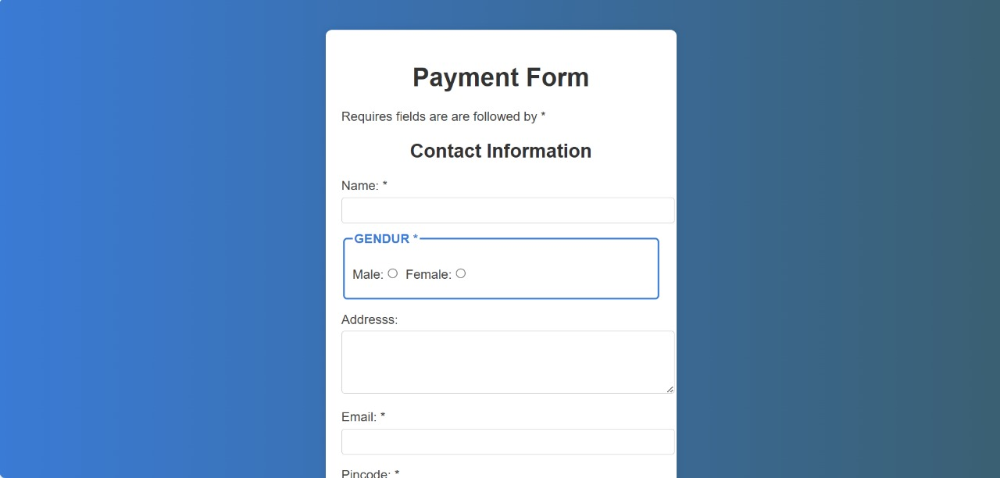

# payment-form
Basic Payment Form is a simple and user-friendly web-based payment form built using HTML &amp; CSS. It includes essential fields like contact information, payment details, and form validation for a smooth user experience.

# 💳 Basic Payment Form

## 🌟 Overview
The **Basic Payment Form** is a simple and elegant web form built using **HTML & CSS**. It allows users to securely enter their contact and payment details with a responsive and user-friendly design.

## 🚀 Features
✔️ Clean and intuitive UI 🌐  
✔️ Required field validation ✅  
✔️ Gender selection with radio buttons 👨‍👩‍👦  
✔️ Address input using a textarea 🏡  
✔️ Payment details (Card Type, Number, Expiry Date, CVV) 💳  
✔️ Stylish form with gradient background 🎨  
✔️ Fully responsive layout 📱  

## 🛠️ Technologies Used
- **HTML5** – For structuring the form
- **CSS3** – For styling and responsiveness

## 📸 Preview



## 📂 Project Structure
```
/basic-payment-form
│── index.html    # Main HTML file
│── style1.css    # CSS Styling file
└── README.md     # Project documentation
```

## 🔧 How to Use
1. Clone the repository:
   ```sh
   git clone https://github.com/rikream/payment_form.git
   ```
2. Open `index.html` in any web browser.

## 🤝 Contributing
Contributions are welcome! Fork the repository, make your changes, and open a **Pull Request**. 😊

## 📜 License
This project is open-source and available under the **MIT License**.

---
🌟 **Enjoy building with this Payment Form!** 💻

